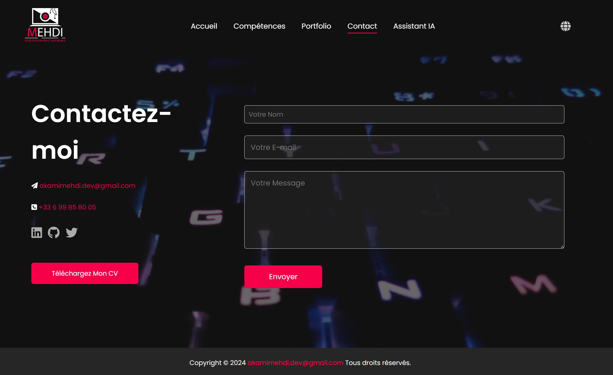

# 📋 Form Automation with Selenium and Python 🚀


---

## 🎥 **Démonstration**

Cliquez sur l'image ci-dessous pour visionner la vidéo de démonstration de mon projet **LAPCOM** :

<a href="https://akamidev.github.io/TEST_FORM/">
    
</a>

---


## 🌟 **Introduction**

Ce projet est un exemple d'automatisation d'un formulaire de contact sur un site web personnel. Utilisant **Selenium WebDriver** en combinaison avec **Python**, le script remplit automatiquement les champs du formulaire et soumet les données.

---

### 🗄️ **Stockage des données**

Les informations soumises via le formulaire sont stockées dans une base de données **SQLite** (`form_data.db`). La base de données contient une table appelée `form_submissions` avec les champs suivants :

- `id` : Identifiant unique (INTEGER, PRIMARY KEY)
- `name` : Nom de l'utilisateur (TEXT)
- `email` : Adresse e-mail de l'utilisateur (TEXT)
- `message` : Message de l'utilisateur (TEXT)
- `submission_date` : Date et heure de la soumission (TIMESTAMP)

Les données peuvent être consultées en utilisant un outil comme **DB Browser for SQLite** ou via des requêtes SQL.

--- 

### 🗂️ Structure du projet

```bash
Copy code
📦 form-automation
├── 📂 data
│   └── form_data.db
├── form_automation.py
├── requirements.txt
└── README.md
```

### 🛠 **Technologies utilisées**

- **Python** 🐍 : Langage de programmation principal.
- **Selenium WebDriver** 🌐 : Outil d'automatisation pour le navigateur.
- **SQLite** 🗄️ : Base de données pour stocker les informations soumises.
- **HTML/CSS** 💻 : Frontend du formulaire de contact.

---

## ⚙️ **Prérequis**
Avant de commencer, assurez-vous d'avoir installé :
- **Python 3.10+**
- **Google Chrome** (version 130.0+)
- **ChromeDriver** (compatible avec votre version de Chrome)

---


### 📦 **Installation**
Clonez le dépôt et installez les dépendances :

```bash
git clone https://github.com/votre-nom-utilisateur/form-automation.git
cd form-automation
pip install -r requirements.txt
```

### 🚀 Utilisation

Assurez-vous que ChromeDriver est installé et configuré dans votre $PATH.
Lancez le script :

```bash
python form_automation.py
Le script :
```

- **Accède au formulaire de contact [Ici](https://akamimehdi.netlify.app/Contact).**

- **Remplit automatiquement les champs** :

Nom
Email
Message
Soumet le formulaire.
Enregistre les données dans une base de données SQLite.


### 📝 Fonctionnalités

🔍 Automatisation du formulaire : Remplit et soumet automatiquement les champs du formulaire.
🗄️ Enregistrement des données : Sauvegarde les données d'inscription dans une base SQLite.
📸 Capture d'écran : Prend une capture d'écran après soumission.

## 🛑 Problèmes connus

Si la version de ChromeDriver ne correspond pas à celle de votre navigateur, vous obtiendrez une erreur SessionNotCreatedException.
Les formulaires utilisant des champs cachés ou des captchas peuvent bloquer l'automatisation.
## 🛠️ Améliorations futures
Ajouter un test automatisé pour vérifier le bon enregistrement des données dans la base de données.
Ajouter un gestionnaire d'exception pour les formulaires protégés par des captchas.

## 🤝 Contribuer

Les contributions sont les bienvenues ! Suivez les étapes ci-dessous pour contribuer :

## Fork le projet

Clonez votre fork : git clone https://github.com/votre-nom-utilisateur/form-automation.git
Créez une branche : git checkout -b ma-nouvelle-fonctionnalite
Commit vos changements : git commit -m 'Ajout de fonctionnalité'
Push vers votre fork : git push origin ma-nouvelle-fonctionnalite
Ouvrez une Pull Request.

### 📄 Licence

Ce projet est sous [licence](https://github.com/akamidev/TEST_FORM/blob/main/LICENSE) MIT.

### 📬 Contact

Pour toute question, n'hésitez pas à me contacter :

- **💼 [LinkedIn](https://www.linkedin.com/in/akami-mehdi/)**
- **🐦 [Portfolio](https://akamimehdi.netlify.app/)**
- **📧 Email : akamimehdi.dev@gmail.com**

---

 **⭐ N'oubliez pas de laisser une étoile si ce projet vous a aidé ! ⭐**

---

